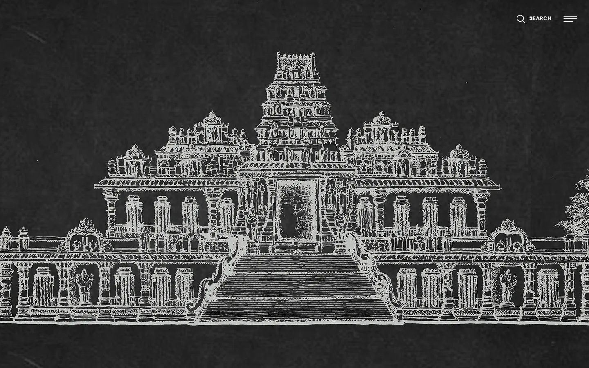
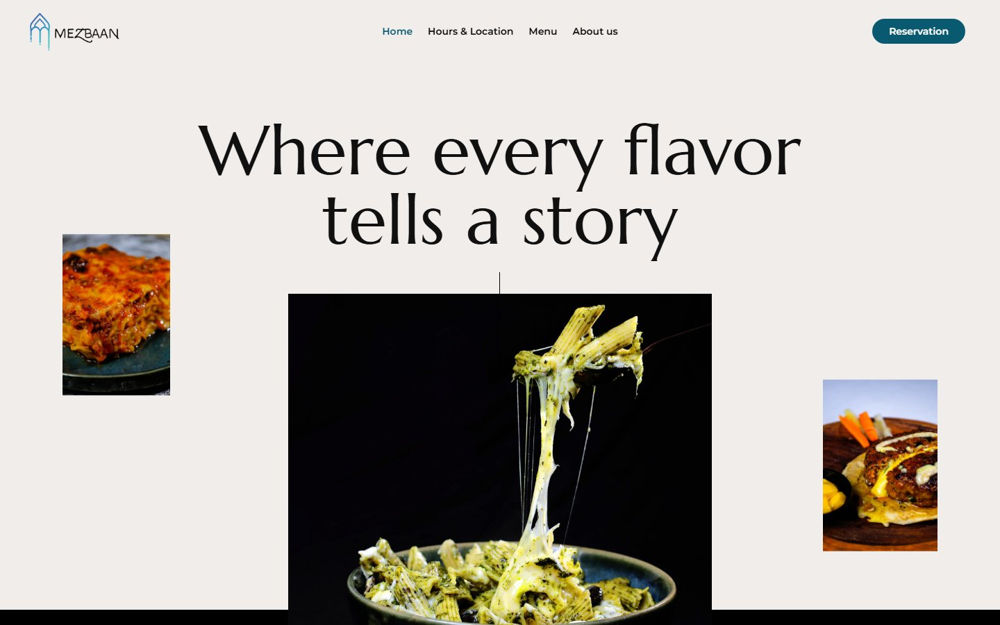
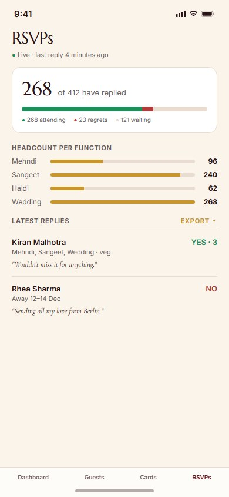

# UX Portfolio — Abdus Saboor Danish

A collection of product design work: end-to-end UX case studies, shipped products, and design exercises.

**→ [View the portfolio](https://asdanish.github.io/ux-portfolio/)** — case studies use a shared stylesheet that GitHub's file viewer won't render, so the live site is the intended way to read them.

## Shipped products

Real products designed and built end-to-end — currently in use or in active development.

| Project | What it is | Case study |
|---|---|---|
|  | **Fifty By Ashhar** — bespoke leather footwear brand: storefront, admin dashboard, and a live ops/workshop app | [View case study](https://asdanish.github.io/ux-portfolio/projects/fifty-by-ashhar.html) |
|  | **Bulava.to** — luxury digital wedding invitation platform, with client site and admin portal | [View case study](https://asdanish.github.io/ux-portfolio/projects/bulava.html) |
|  | **Ambur First** — hyperlocal community app for the town of Ambur | [View case study](https://asdanish.github.io/ux-portfolio/projects/ambur-first.html) |
|  | **Vanzscape** — architecture &amp; landscape design studio website | [View case study](https://asdanish.github.io/ux-portfolio/projects/vanzscape.html) |
|  | **Mezbaan** — Turkish-Italian restaurant website | [View case study](https://asdanish.github.io/ux-portfolio/projects/mezbaan-foods.html) |

## Original iOS app concepts

Ground-up concept designs, built directly in code (not Figma) and prototyped as real iOS screens.

| Project | What it is | Case study |
|---|---|---|
|  | **RailWake** — live train tracking with a geo-alarm that wakes you before your stop | [View case study](https://asdanish.github.io/ux-portfolio/projects/railwake.html) |
|  | **Fifty By Ashhar Mobile** — native iOS shopping app extending the existing luxury footwear brand | [View case study](https://asdanish.github.io/ux-portfolio/projects/fifty-by-ashhar-app.html) |
|  | **Drift** — a calm sleep app with a gentle wake-window alarm and soundscape mixer | [View case study](https://asdanish.github.io/ux-portfolio/projects/drift.html) |
|  | **Bulava Host App** — iOS companion app for running a wedding: guest import, RSVPs, and send | [View case study](https://asdanish.github.io/ux-portfolio/projects/bulava-app.html) |

## UX case studies & design work

| Project | What it is | Case study |
|---|---|---|
|  | **JOBABLE** — job search & application platform, web + mobile | [View case study](https://asdanish.github.io/ux-portfolio/projects/jobable.html) |
|  | **Jones Road UX Audit** — heatmap-based UX audit & redesign exercise | [View case study](https://asdanish.github.io/ux-portfolio/projects/jones-road-audit.html) |
|  | **ARCHOVA** — architectural visualization studio website | [View case study](https://asdanish.github.io/ux-portfolio/projects/archova.html) |
|  | **Vanscape** — landscaping business website | [View case study](https://asdanish.github.io/ux-portfolio/projects/vanscape.html) |
|  | **Zoho Assist Redesign** — remote support dashboard UI exploration | [View case study](https://asdanish.github.io/ux-portfolio/projects/zoho-assist-redesign.html) |
|  | **Daily UI Challenge** — Day 1–9 UI explorations | [View case study](https://asdanish.github.io/ux-portfolio/projects/daily-ui-challenge.html) |

---

*Not yet included: hardwareshack.in and an SEO case study for Archova/HardwareShack, pending real analytics/Search Console data. This repo will be updated as more case studies are written up.*
